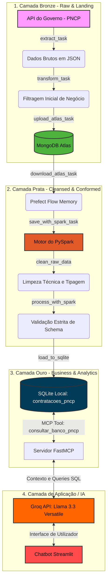

# 📊 Data Engineering & GenAI: PNCP Hybrid Pipeline & Chatbot

## ❓ Sobre o Projeto

Este repositório contém uma solução de **Engenharia de Dados ponta a ponta** completamente containerizada para ingestão, processamento analítico e consumo inteligente de dados semiestruturados (JSON) provenientes do **PNCP (Portal Nacional de Contratações Públicas)**.

### 🔄 Evolução da Arquitetura

Originalmente focado apenas na ingestão e persistência de dados brutos e refinados no **MongoDB Atlas** utilizando Python nativo, o projeto evoluiu para uma **Arquitetura Híbrida Moderna**.

O ecossistema agora combina:
- ⚡ **PySpark** para processamento de dados e validação de esquemas;
- 🎯 **Prefect** para orquestração e monitoramento de falhas dos pipelines;
- 🗄️ **MongoDB Atlas** para armazenamento histórico da camada *Raw*;
- 📊 **SQLite** para consultas analíticas estruturadas locais;
- 🤖 **Groq + Llama 3.3** para IA Generativa de altíssima velocidade;
- 🔗 **FastMCP** para integração e execução de ferramentas cognitivas (Model Context Protocol);
- 🌐 **Streamlit** para fornecer uma interface web conversacional fluida.

---

## 🏗️ Arquitetura da Solução (Padrão Medalhão)

O ecossistema foi desenhado sob o conceito de **Baixo Acoplamento**, garantindo que o motor do Spark receba dados puramente estruturados na memória e as camadas se dividam em níveis de maturidade crescentes:



---

## 🛠️ Tecnologias Utilizadas

| Categoria | Tecnologia |
| --- | --- |
| **Linguagem** | Python 3.11 |
| **Processamento distribuído** | PySpark 3.5 |
| **Orquestração de Workflows** | Prefect 3.7.4 |
| **Banco de Dados NoSQL** | MongoDB Atlas |
| **Driver de Conexão NoSQL** | PyMongo |
| **Banco Analítico Relacional** | SQLite3 |
| **Manipulação de DataFrames** | Pandas & Tabulate |
| **Interface de Usuário (UI)** | Streamlit |
| **Protocolo de Integração LLM** | FastMCP (Model Context Protocol) |
| **Provedor de Inferência de IA** | Groq Cloud |
| **Modelo de Linguagem (LLM)** | Llama 3.3 70B Versatile |
| **Ambientes Isolados** | Docker & Docker Compose |

---

## 📦 Como Executar o Projeto

Siga os passos abaixo no terminal da sua máquina local para levantar o ecossistema completo:

### 1. Inicialização do Ambiente

Certifique-se de que o **Docker Desktop** está ativo e execute os passos dentro da pasta raiz do projeto:

```bash
# 1. Crie e configure o seu arquivo de credenciais baseado no exemplo
cp .env.example .env

# 2. Caso seja a primeira execução, construa a imagem base dos containers
docker compose build

# 3. Inicialize o Servidor Central do Prefect e o container do Spark em segundo plano
docker compose up -d

```

### 2. Disparo do Pipeline de Dados (ETL)

Com a infraestrutura ativa, execute a orquestração para alimentar o ecossistema:

```bash
# Executa o pipeline que transiciona os dados da Camada Bronze à Camada Ouro
docker compose exec smart-pncp python /app/orchestrate_prefect.py

```

> 🎛️ **Monitoramento:** Abra o navegador em `http://localhost:4200` para acompanhar as tarefas e o tempo de execução do motor do Spark em tempo real pela interface gráfica do **Prefect Server**.

### 3. Execução do Assistente de IA (Chatbot)

Após a conclusão do pipeline, ligue a interface de IA para interagir com os dados consolidados:

```bash
# Ativa o chatbot Streamlit acoplado ao servidor MCP do banco de dados
docker compose exec smart-pncp streamlit run /app/app_chatbot_groq.py --server.port=8501 --server.address=0.0.0.0

```

> 🦙 **Acesso:** Acesse o chatbot pelo navegador através do endereço: `http://localhost:8501`

---

## 👥 Equipe

* **Allan Ronald Vasconcelos**
* **Matheus Rangel Kirzner**
* **Júlia Oliveira Veríssimo**

---

## 📜 Licença

Este projeto está licenciado sob os termos da licença **MIT**.
Consulte o arquivo `LICENSE` no repositório para obter mais detalhes.

```


Este projeto está licenciado sob a licença **MIT**.

Consulte o arquivo `LICENSE` para mais informações.
